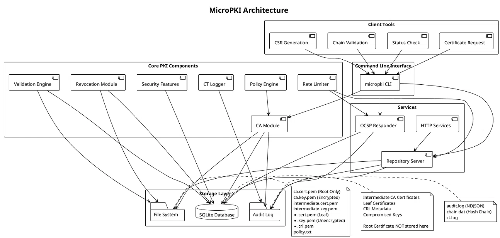

# MicroPKI

[](https://opensource.org/licenses/MIT)
[](https://github.com/serblowup/MicroPKI)

Минимальная реализация инфраструктуры открытых ключей (PKI) в рамках курса криптографии.

## Возможности

- Создание самоподписанного корневого УЦ (RSA 4096 или ECC P-384)
- Создание промежуточного УЦ, подписанного корневым
- Выпуск сертификатов по шаблонам: server, client, code_signing
- Выпуск сертификатов OCSP-ответчика с расширением OCSPSigning
- Поддержка Subject Alternative Name (SAN) - DNS, IP, email, URI
- Подписание внешних CSR
- Клиентские команды: генерация CSR, запрос сертификатов, валидация цепочек
- Проверка статуса отзыва
- Проверка цепочки сертификатов
- Отзыв сертификатов с поддержкой всех причин RFC 5280
- Генерация и распространение списков отзыва (CRL)
- OCSP-ответчик (Online Certificate Status Protocol) для проверки статуса сертификатов в реальном времени
- Аудит-система с криптографической целостностью (NDJSON + SHA-256 хеш-цепочка)
- Обнаружение аномалий в аудит-логе
- Симуляция Certificate Transparency (CT лог)
- Политики безопасности: размеры ключей, сроки действия, SAN, алгоритмы
- Ограничение частоты запросов (Rate Limiting)
- Симуляция компрометации приватных ключей
- Блокировка скомпрометированных ключей
- Безопасное хранение ключей с шифрованием (AES-256)
- Генерация X.509 сертификатов с правильными расширениями
- Документирование политики сертификации
- SQLite БД для хранения всех выпущенных сертификатов
- Уникальные серийные номера (64-битные: timestamp + random)
- Автоматическое сохранение сертификатов в БД при выпуске
- Просмотр сертификатов в табличном, JSON и CSV форматах
- HTTP репозиторий для получения сертификатов, CRL и приема CSR по API

## Архитектура проекта

Ниже представлена архитектурная диаграмма MicroPKI, показывающая основные компоненты и их взаимодействие:



**Описание компонентов:**

| Компонент | Описание |
|-----------|----------|
| **CA Module** | Создание и управление корневым и промежуточными УЦ, выпуск сертификатов с поддержкой шаблонов |
| **Validation Engine** | Построение цепочек сертификатов, валидация путей по RFC 5280, проверка подписей и сроков действия |
| **Revocation Module** | Управление отзывом сертификатов, генерация CRL, OCSP-ответчик для проверки статуса в реальном времени |
| **SQLite Database** | Хранение всех выпущенных сертификатов, метаданных CRL и скомпрометированных ключей |
| **File System** | Хранение зашифрованных ключей УЦ, PEM-сертификатов и CRL-файлов с правами 0600/0700 |
| **Audit Log** | NDJSON-формат с SHA-256 хеш-цепочкой для защиты от подделки |
| **Repository Server** | HTTP API для получения сертификатов, распространения CRL и приёма CSR |
| **OCSP Responder** | Ответчик по протоколу OCSP с кэшированием и ограничением частоты запросов |
| **Policy Engine** | Принудительная проверка политик: размеры ключей, сроки действия, ограничения SAN |
| **Rate Limiter** | Алгоритм Token Bucket для защиты от DoS-атак |
| **CT Logger** | Симуляция Certificate Transparency для аудита |
| **Compromise Detection** | Отслеживание скомпрометированных ключей и блокировка их повторного использования |
| **Client Tools** | Утилиты для генерации CSR, запроса сертификатов, валидации цепочек и проверки статуса |
```

## Требования

- Go 1.21 или выше (разработка на go 1.25.7)
- Make (для сборки)
- OpenSSL (для проверки сертификатов, CRL и OCSP)
- SQLite 3.x (встроенная через go-sqlite3)

## Зависимости

- github.com/spf13/cobra (CLI фреймворк)
- github.com/mattn/go-sqlite3 (драйвер SQLite)
- golang.org/x/crypto/ocsp (OCSP библиотека)
- Стандартные криптографические пакеты Go

## Установка

```bash
# Клонирование репозитория
git clone https://github.com/serblowup/MicroPKI.git
cd MicroPKI/micropki

# Установка зависимостей
go mod tidy

# Сборка проекта
make build

# Запуск всех тестов
make test

# Запуск всех скриптов
make scripts
```

После сборки бинарный файл будет доступен в `./bin/micropki`.

---

## Команды

### 1. Работа с базой данных (`db`)

#### `db init` - инициализация базы данных

```bash
# Инициализация новой БД
./bin/micropki db init --db-path ./pki/micropki.db

# Принудительная перезапись существующей БД
./bin/micropki db init --db-path ./pki/micropki.db --force
```

| Параметр | Описание | Значение по умолчанию |
|----------|----------|----------------------|
| `--db-path` | Путь к SQLite базе данных | `./pki/micropki.db` |
| `--force` | Принудительная перезапись | `false` |
| `--log-file` | Файл для логов | stderr |

### 2. Управление удостоверяющими центрами (`ca`)

#### `ca init` - инициализация корневого УЦ

```bash
# Создание корневого УЦ (RSA 4096) с сохранением в БД
./bin/micropki ca init \
    --subject "/CN=Test Root CA" \
    --key-type rsa \
    --key-size 4096 \
    --passphrase-file ./root.pass \
    --out-dir ./pki \
    --db-path ./pki/micropki.db \
    --validity-days 3650
```

| Параметр | Описание | Значение по умолчанию |
|----------|----------|----------------------|
| `--subject` | Distinguished Name (обязательно) | - |
| `--key-type` | Тип ключа: `rsa` или `ecc` | `rsa` |
| `--key-size` | Размер ключа в битах | `4096` (RSA), `384` (ECC) |
| `--passphrase-file` | Файл с парольной фразой (обязательно) | - |
| `--out-dir` | Выходная директория | `./pki` |
| `--db-path` | Путь к SQLite базе данных | `./pki/micropki.db` |
| `--validity-days` | Срок действия в днях | `3650` (10 лет) |
| `--log-file` | Файл для логов | stderr |
| `--force` | Принудительная перезапись | `false` |

**Политики безопасности:**
- RSA ключ корневого CA должен быть не менее 4096 бит
- ECC ключ корневого CA должен быть не менее P-384
- Срок действия корневого CA не более 3650 дней (10 лет)

#### `ca issue-intermediate` - создание промежуточного УЦ

```bash
# Создание промежуточного УЦ с сохранением в БД
./bin/micropki ca issue-intermediate \
    --root-cert ./pki/certs/ca.cert.pem \
    --root-key ./pki/private/ca.key.pem \
    --root-pass-file ./root.pass \
    --subject "/CN=Test Intermediate CA" \
    --key-type rsa \
    --key-size 4096 \
    --passphrase-file ./inter.pass \
    --out-dir ./pki \
    --db-path ./pki/micropki.db \
    --validity-days 1825 \
    --pathlen 0
```

| Параметр | Описание | Значение по умолчанию |
|----------|----------|----------------------|
| `--root-cert` | Путь к сертификату корневого УЦ | - |
| `--root-key` | Путь к зашифрованному ключу корневого УЦ | - |
| `--root-pass-file` | Файл с паролем корневого УЦ | - |
| `--subject` | Отличительное имя для промежуточного УЦ | - |
| `--key-type` | Тип ключа: `rsa` или `ecc` | `rsa` |
| `--key-size` | Размер ключа в битах | `4096` |
| `--passphrase-file` | Парольная фраза для ключа промежуточного УЦ | - |
| `--out-dir` | Выходная директория | `./pki` |
| `--db-path` | Путь к SQLite базе данных | `./pki/micropki.db` |
| `--validity-days` | Срок действия в днях | `1825` (5 лет) |
| `--pathlen` | Ограничение длины пути | `0` |
| `--log-file` | Файл для логов | stderr |
| `--force` | Принудительная перезапись | `false` |

**Политики безопасности:**
- RSA ключ промежуточного CA должен быть не менее 3072 бит (рекомендуется 4096)
- ECC ключ промежуточного CA должен быть не менее P-384
- Срок действия промежуточного CA не более 1825 дней (5 лет)
- Path Length Constraint не более 0

#### `ca issue-cert` - выпуск конечного сертификата

```bash
# Серверный сертификат с SAN (автосохранение в БД)
./bin/micropki ca issue-cert \
    --ca-cert ./pki/certs/intermediate.cert.pem \
    --ca-key ./pki/private/intermediate.key.pem \
    --ca-pass-file ./inter.pass \
    --template server \
    --subject "/CN=example.com" \
    --san dns:example.com \
    --san dns:www.example.com \
    --san ip:192.168.1.10 \
    --out-dir ./pki/certs \
    --db-path ./pki/micropki.db \
    --validity-days 365

# Клиентский сертификат
./bin/micropki ca issue-cert \
    --ca-cert ./pki/certs/intermediate.cert.pem \
    --ca-key ./pki/private/intermediate.key.pem \
    --ca-pass-file ./inter.pass \
    --template client \
    --subject "/CN=Alice Smith" \
    --san email:alice@example.com \
    --out-dir ./pki/certs \
    --db-path ./pki/micropki.db \
    --validity-days 365

# Сертификат для подписи кода
./bin/micropki ca issue-cert \
    --ca-cert ./pki/certs/intermediate.cert.pem \
    --ca-key ./pki/private/intermediate.key.pem \
    --ca-pass-file ./inter.pass \
    --template code_signing \
    --subject "/CN=MicroPKI Code Signer" \
    --out-dir ./pki/certs \
    --db-path ./pki/micropki.db \
    --validity-days 365

# Подписание внешнего CSR
./bin/micropki ca issue-cert \
    --ca-cert ./pki/certs/intermediate.cert.pem \
    --ca-key ./pki/private/intermediate.key.pem \
    --ca-pass-file ./inter.pass \
    --template server \
    --subject "/CN=external.com" \
    --san dns:external.com \
    --csr ./external.csr \
    --out-dir ./pki/certs \
    --db-path ./pki/micropki.db \
    --validity-days 30
```

| Параметр | Описание | Значение по умолчанию |
|----------|----------|----------------------|
| `--ca-cert` | Сертификат промежуточного УЦ | - |
| `--ca-key` | Зашифрованный ключ промежуточного УЦ | - |
| `--ca-pass-file` | Парольная фраза для ключа УЦ | - |
| `--template` | Шаблон: `server`, `client`, `code_signing` | - |
| `--subject` | Отличительное имя для сертификата | - |
| `--san` | Альтернативные имена субъекта | `[]` |
| `--csr` | Подписать внешний CSR (опционально) | - |
| `--out-dir` | Выходная директория | `./pki/certs` |
| `--db-path` | Путь к SQLite базе данных | `./pki/micropki.db` |
| `--validity-days` | Срок действия в днях | `365` |
| `--log-file` | Файл для логов | stderr |
| `--force` | Принудительная перезапись | `false` |

**Политики безопасности:**
- RSA ключ конечного субъекта должен быть не менее 2048 бит
- ECC ключ конечного субъекта должен быть не менее P-256
- Срок действия конечного сертификата не более 365 дней (1 год)
- Wildcard SAN (`*.example.com`) запрещены по умолчанию
- Server: только DNS и IP SAN
- Client: DNS, IP, email
- Code Signing: DNS, URI (email и IP запрещены)
- SHA-1 запрещен, только SHA-256 и выше

#### `ca issue-ocsp-cert` - выпуск сертификата OCSP-ответчика

```bash
# Выпуск сертификата OCSP-ответчика
./bin/micropki ca issue-ocsp-cert \
    --ca-cert ./pki/certs/intermediate.cert.pem \
    --ca-key ./pki/private/intermediate.key.pem \
    --ca-pass-file ./inter.pass \
    --subject "/CN=OCSP Responder" \
    --key-type rsa \
    --key-size 2048 \
    --san dns:ocsp.example.com \
    --out-dir ./pki/ocsp \
    --validity-days 365
```

| Параметр | Описание | Значение по умолчанию |
|----------|----------|----------------------|
| `--ca-cert` | Сертификат CA для подписи (обязательно) | - |
| `--ca-key` | Ключ CA (обязательно) | - |
| `--ca-pass-file` | Файл с паролем CA ключа (обязательно) | - |
| `--subject` | Subject для OCSP-сертификата (обязательно) | - |
| `--key-type` | Тип ключа: `rsa` или `ecc` | `rsa` |
| `--key-size` | Размер ключа (RSA: 2048+, ECC: 256+) | `2048` |
| `--san` | SAN (DNS имена) | `[]` |
| `--out-dir` | Выходная директория | `./pki/ocsp` |
| `--validity-days` | Срок действия в днях | `365` |
| `--db-path` | Путь к SQLite базе данных | `./pki/micropki.db` |

**Особенности сертификата OCSP-ответчика:**
- Extended Key Usage: `OCSPSigning` (1.3.6.1.5.5.7.3.9)
- Key Usage: `digitalSignature` (только)
- Basic Constraints: `CA=FALSE`
- Приватный ключ сохраняется **незашифрованным** с правами `0600` (требуется для автоматического запуска)

#### `ca compromise` - симуляция компрометации приватного ключа

```bash
# Симуляция компрометации ключа
./bin/micropki ca compromise \
    --cert ./pki/certs/example.com.cert.pem \
    --reason keyCompromise \
    --force

# С подтверждением (без --force)
./bin/micropki ca compromise \
    --cert ./pki/certs/example.com.cert.pem \
    --reason keyCompromise
```

| Параметр | Описание | Значение по умолчанию |
|----------|----------|----------------------|
| `--cert` | Путь к сертификату для компрометации (обязательно) | - |
| `--reason` | Причина: keyCompromise, cACompromise | `keyCompromise` |
| `--force` | Пропустить подтверждение | `false` |
| `--db-path` | Путь к SQLite базе данных | `./pki/micropki.db` |

При компрометации происходит:
1. Немедленный отзыв сертификата с указанной причиной
2. Добавление публичного ключа в таблицу `compromised_keys`
3. Создание записи в аудит-логе с высоким уровнем важности
4. Блокировка повторного использования скомпрометированного ключа

#### `ca revoke` - отзыв сертификата

```bash
# Отзыв сертификата по серийному номеру
./bin/micropki ca revoke 0baee839362091a1 --reason keyCompromise

# Отзыв с подтверждением (без --force)
./bin/micropki ca revoke 0baee839362091a1 --reason superseded

# Принудительный отзыв без подтверждения
./bin/micropki ca revoke 0baee839362091a1 --reason keyCompromise --force
```

| Параметр | Описание | Значение по умолчанию |
|----------|----------|----------------------|
| `serial` | Серийный номер в hex формате (обязательно) | - |
| `--reason` | Причина отзыва: unspecified, keyCompromise, cACompromise, affiliationChanged, superseded, cessationOfOperation, certificateHold, removeFromCRL, privilegeWithdrawn, aACompromise | `unspecified` |
| `--crl` | Путь к CRL файлу для обновления | автоматически |
| `--force` | Пропустить подтверждение | `false` |
| `--db-path` | Путь к SQLite базе данных | `./pki/micropki.db` |

#### `ca gen-crl` - генерация списка отозванных сертификатов (CRL)

```bash
# Генерация CRL для промежуточного УЦ
./bin/micropki ca gen-crl --ca intermediate --next-update 14

# Генерация CRL для корневого УЦ с пользовательским путем
./bin/micropki ca gen-crl --ca root --next-update 7 --out-file ./backup/root.crl.pem

# Генерация CRL с указанием сертификата и ключа
./bin/micropki ca gen-crl --ca custom \
    --ca-cert ./pki/certs/custom.cert.pem \
    --ca-key ./pki/private/custom.key.pem \
    --ca-pass-file ./custom.pass \
    --next-update 30
```

| Параметр | Описание | Значение по умолчанию |
|----------|----------|----------------------|
| `--ca` | УЦ: root, intermediate или путь к сертификату | - |
| `--next-update` | Дней до следующего обновления CRL | `7` |
| `--out-file` | Выходной файл CRL | `pki/crl/<ca>.crl.pem` |
| `--ca-cert` | Путь к сертификату УЦ (опционально) | - |
| `--ca-key` | Путь к ключу УЦ (опционально) | - |
| `--ca-pass-file` | Файл с паролем УЦ (опционально) | - |
| `--db-path` | Путь к SQLite базе данных | `./pki/micropki.db` |

#### `ca check-revoked` - проверка статуса отзыва

```bash
# Проверка статуса сертификата
./bin/micropki ca check-revoked 0baee839362091a1
```

| Параметр | Описание | Значение по умолчанию |
|----------|----------|----------------------|
| `serial` | Серийный номер в hex формате (обязательно) | - |
| `--db-path` | Путь к SQLite базе данных | `./pki/micropki.db` |

#### `ca list-certs` - просмотр сертификатов в БД 

```bash
# Табличный вывод (вывод по умолчанию)
./bin/micropki ca list-certs --db-path ./pki/micropki.db --format table

# JSON формат
./bin/micropki ca list-certs --db-path ./pki/micropki.db --format json

# CSV формат
./bin/micropki ca list-certs --db-path ./pki/micropki.db --format csv

# Фильтр по статусу
./bin/micropki ca list-certs --db-path ./pki/micropki.db --status valid
```

| Параметр | Описание | Значение по умолчанию |
|----------|----------|----------------------|
| `--db-path` | Путь к SQLite базе данных | `./pki/micropki.db` |
| `--status` | Фильтр по статусу (valid, revoked, expired) | все |
| `--format` | Формат вывода: `table`, `json`, `csv` | `table` |
| `--log-file` | Файл для логов | stderr |

#### `ca show-cert` - просмотр конкретного сертификата

```bash
# Показать сертификат по серийному номеру
./bin/micropki ca show-cert 0baee839362091a1 --db-path ./pki/micropki.db

# Сохранить в файл
./bin/micropki ca show-cert 0baee839362091a1 --db-path ./pki/micropki.db > cert.pem
```

| Параметр | Описание | Значение по умолчанию |
|----------|----------|----------------------|
| `serial` | Серийный номер в hex формате (обязательно) | - |
| `--db-path` | Путь к SQLite базе данных | `./pki/micropki.db` |
| `--log-file` | Файл для логов | stderr |

#### `ca verify` - проверка цепочки сертификатов

```bash
./bin/micropki ca verify \
    --root ./pki/certs/ca.cert.pem \
    --intermediate ./pki/certs/intermediate.cert.pem \
    --leaf ./pki/certs/example.com.cert.pem
```

### 3. Аудит-система (`audit`)

Аудит-система обеспечивает:
- Запись всех критических операций в NDJSON формате
- Криптографическую целостность через SHA-256 хеш-цепочку
- Обнаружение подделки, удаления или изменения записей
- Фильтрацию и поиск записей
- Экспорт в table, JSON и CSV форматах

**Расположение файлов аудита:**

```
./pki/audit/
├── audit.log    # Аудит-лог в формате NDJSON
└── chain.dat    # Файл с хешами для проверки целостности
```

**Формат записи аудит-лога:**

```json
{
  "timestamp": "2026-04-26T11:03:29.357117548Z",
  "level": "AUDIT",
  "operation": "certificate_issued",
  "status": "success",
  "message": "Issued server certificate for CN=example.com",
  "metadata": {
    "serial": "be22c9bb05b08eb",
    "subject": "/CN=example.com",
    "template": "server"
  },
  "integrity": {
    "prev_hash": "abc123...",
    "hash": "def456..."
  }
}
```

#### `audit query` - запрос аудит-лога

```bash
# Показать все записи
./bin/micropki audit query

# Фильтр по операции
./bin/micropki audit query --operation issue

# Фильтр по времени
./bin/micropki audit query --from "2026-04-26T00:00:00Z" --to "2026-04-26T23:59:59Z"

# Фильтр по уровню
./bin/micropki audit query --level AUDIT

# Фильтр по серийному номеру
./bin/micropki audit query --serial be22c9bb05b08eb

# Вывод в JSON формате
./bin/micropki audit query --format json

# Вывод в CSV формате
./bin/micropki audit query --format csv

# С проверкой целостности найденных записей
./bin/micropki audit query --verify
```

| Параметр | Описание | Значение по умолчанию |
|----------|----------|----------------------|
| `--from` | Начальная временная метка (ISO 8601) | - |
| `--to` | Конечная временная метка (ISO 8601) | - |
| `--level` | Уровень: AUDIT, INFO, WARNING, ERROR | - |
| `--operation` | Фильтр по типу операции | - |
| `--serial` | Фильтр по серийному номеру | - |
| `--format` | Формат вывода: table, json, csv | `table` |
| `--verify` | Проверить целостность найденных записей | `false` |
| `--log-file` | Путь к файлу аудит-лога | `./pki/audit/audit.log` |

#### `audit verify` - проверка целостности аудит-лога

```bash
# Проверка целостности (exit code 0 = целостен, 1 = нарушение)
./bin/micropki audit verify

# С указанием путей
./bin/micropki audit verify \
    --log-file ./pki/audit/audit.log \
    --chain-file ./pki/audit/chain.dat
```

| Параметр | Описание | Значение по умолчанию |
|----------|----------|----------------------|
| `--log-file` | Путь к файлу аудит-лога | `./pki/audit/audit.log` |
| `--chain-file` | Путь к файлу цепочки хешей | `./pki/audit/chain.dat` |

**Принцип работы:**
1. Читаются все записи из audit.log
2. Для каждой записи проверяется:
   - `prev_hash` совпадает с хешем предыдущей записи
   - `hash` совпадает с SHA-256 вычисленным от содержимого записи
3. При обнаружении несовпадения выводится индекс первой поврежденной записи

#### `audit ct-verify` - проверка Certificate Transparency лога

```bash
# Проверка по серийному номеру
./bin/micropki audit ct-verify --serial be22c9bb05b08eb

# Проверка по SHA-256 отпечатку
./bin/micropki audit ct-verify --fingerprint abc123...
```

| Параметр | Описание | Значение по умолчанию |
|----------|----------|----------------------|
| `--serial` | Серийный номер сертификата | - |
| `--fingerprint` | SHA-256 отпечаток сертификата | - |
| `--ct-log` | Путь к CT логу | `./pki/audit/ct.log` |

#### `audit detect-anomalies` - обнаружение аномалий

```bash
# Поиск аномалий с порогом 50 событий в час
./bin/micropki audit detect-anomalies --threshold 50

# Поиск аномалий с низким порогом
./bin/micropki audit detect-anomalies --threshold 10
```

| Параметр | Описание | Значение по умолчанию |
|----------|----------|----------------------|
| `--threshold` | Порог событий в час | `100` |
| `--log-file` | Путь к файлу аудит-лога | `./pki/audit/audit.log` |

**Обнаруживаемые аномалии:**
- Высокая частота событий (превышение порога в час)
- Подозрительно высокая частота отзывов (>30% от всех операций)
- Обнаружение событий компрометации ключей
- Высокая частота ошибок

### 4. Certificate Transparency (CT) лог

CT лог автоматически создается при выпуске сертификатов и хранится в `./pki/audit/ct.log`.

```bash
# Просмотр CT лога
cat ./pki/audit/ct.log

# Проверка наличия сертификата
./bin/micropki audit ct-verify --serial be22c9bb05b08eb
```

**Формат записи CT лога:**

```json
{
  "timestamp": "2026-04-26T11:04:00Z",
  "serial_hex": "0be21020a2c53b85",
  "subject_dn": "CN=example.com",
  "sha256_fingerprint": "88760843bb8897a680...",
  "issuer_dn": "CN=Test Intermediate CA"
}
```

### 5. Ограничение частоты запросов (Rate Limiting)

Поддерживается для HTTP репозитория и OCSP-ответчика.

```bash
# Запуск репозитория с rate limiting (1 запрос/сек, burst 5)
./bin/micropki repo serve \
    --host 127.0.0.1 \
    --port 8080 \
    --rate-limit 1 \
    --rate-burst 5

# Запуск OCSP с rate limiting
./bin/micropki ocsp serve \
    --responder-cert ./pki/ocsp/ocsp.cert.pem \
    --responder-key ./pki/ocsp/ocsp.key.pem \
    --ca-cert ./pki/certs/intermediate.cert.pem \
    --rate-limit 10 \
    --rate-burst 20
```

| Параметр | Описание | Значение по умолчанию |
|----------|----------|----------------------|
| `--rate-limit` | Запросов в секунду (0 = отключено) | `0` |
| `--rate-burst` | Максимальный burst | `10` |

При превышении лимита возвращается HTTP 429 с заголовком `Retry-After`.

### 6. Клиентские команды (`client`) 

#### `client gen-csr` - генерация CSR

```bash
# Генерация CSR для серверного сертификата
./bin/micropki client gen-csr \
    --subject "/CN=app.example.com" \
    --key-type rsa \
    --key-size 2048 \
    --san dns:app.example.com \
    --san dns:api.example.com \
    --out-key ./app.key.pem \
    --out-csr ./app.csr.pem

# Генерация CSR с ECC ключом
./bin/micropki client gen-csr \
    --subject "/CN=ecc.example.com" \
    --key-type ecc \
    --key-size 256 \
    --san dns:ecc.example.com \
    --out-key ./ecc.key.pem \
    --out-csr ./ecc.csr.pem
```

| Параметр | Описание | Значение по умолчанию |
|----------|----------|----------------------|
| `--subject` | Distinguished Name (обязательно) | - |
| `--key-type` | Тип ключа: `rsa` или `ecc` | `rsa` |
| `--key-size` | Размер ключа (RSA: 2048/4096, ECC: 256/384) | `2048` |
| `--san` | Альтернативные имена (dns:example.com,ip:1.2.3.4) | `[]` |
| `--out-key` | Выходной файл ключа | `./key.pem` |
| `--out-csr` | Выходной файл CSR | `./request.csr.pem` |
| `--log-file` | Файл для логов | stderr |

**Примечание:** Приватный ключ сохраняется незашифрованным с правами `0600`. Выводится предупреждение.

#### `client request-cert` - запрос сертификата у CA

```bash
# Отправка CSR в CA через HTTP API
./bin/micropki client request-cert \
    --csr ./app.csr.pem \
    --template server \
    --ca-url http://localhost:8080 \
    --out-cert ./app.cert.pem

# С API ключом (если настроен)
./bin/micropki client request-cert \
    --csr ./app.csr.pem \
    --template server \
    --ca-url http://localhost:8080 \
    --api-key changeme \
    --out-cert ./app.cert.pem
```

| Параметр | Описание | Значение по умолчанию |
|----------|----------|----------------------|
| `--csr` | Путь к CSR файлу (обязательно) | - |
| `--template` | Шаблон: `server`, `client`, `code_signing` (обязательно) | - |
| `--ca-url` | URL CA сервера | `http://localhost:8080` |
| `--out-cert` | Выходной файл сертификата | `./cert.pem` |
| `--api-key` | API ключ (опционально) | - |
| `--log-file` | Файл для логов | stderr |

#### `client validate` - валидация цепочки сертификатов

```bash
# Базовая валидация цепочки
./bin/micropki client validate \
    --cert ./app.cert.pem \
    --untrusted ./pki/certs/intermediate.cert.pem \
    --trusted ./pki/certs/ca.cert.pem \
    --mode chain

# Полная валидация с проверкой отзыва через CRL
./bin/micropki client validate \
    --cert ./app.cert.pem \
    --untrusted ./pki/certs/intermediate.cert.pem \
    --trusted ./pki/certs/ca.cert.pem \
    --crl ./pki/crl/intermediate.crl.pem \
    --mode full

# Валидация с указанием времени
./bin/micropki client validate \
    --cert ./app.cert.pem \
    --untrusted ./pki/certs/intermediate.cert.pem \
    --trusted ./pki/certs/ca.cert.pem \
    --validation-time "2026-01-01T00:00:00Z"
```

| Параметр | Описание | Значение по умолчанию |
|----------|----------|----------------------|
| `--cert` | Путь к конечному сертификату (обязательно) | - |
| `--untrusted` | Промежуточные сертификаты (можно несколько) | `[]` |
| `--trusted` | Доверенные корневые сертификаты | `./pki/certs/ca.cert.pem` |
| `--crl` | CRL файл или URL | - |
| `--ocsp` | Проверять через OCSP | `false` |
| `--mode` | Режим: `chain` (только цепочка) или `full` (с отзывом) | `full` |
| `--validation-time` | Время валидации (RFC3339) | текущее время |
| `--log-file` | Файл для логов | stderr |

#### `client check-status` - проверка статуса отзыва

```bash
# Проверка с автоматическим fallback (OCSP -> CRL)
./bin/micropki client check-status \
    --cert ./app.cert.pem \
    --ca-cert ./pki/certs/intermediate.cert.pem

# Проверка с указанием CRL
./bin/micropki client check-status \
    --cert ./app.cert.pem \
    --ca-cert ./pki/certs/intermediate.cert.pem \
    --crl ./pki/crl/intermediate.crl.pem

# Проверка с указанием OCSP URL
./bin/micropki client check-status \
    --cert ./app.cert.pem \
    --ca-cert ./pki/certs/intermediate.cert.pem \
    --ocsp-url http://ocsp.example.com
```

| Параметр | Описание | Значение по умолчанию |
|----------|----------|----------------------|
| `--cert` | Путь к сертификату (обязательно) | - |
| `--ca-cert` | Сертификат издателя (обязательно) | - |
| `--crl` | CRL файл или URL | - |
| `--ocsp-url` | URL OCSP ответчика | из AIA сертификата |
| `--log-file` | Файл для логов | stderr |

**Логика проверки отзыва:**
1. OCSP первый - если доступен OCSP URL (из AIA или указан явно)
2. Fallback на CRL - если OCSP недоступен или вернул `unknown`
3. Результат - `good`, `revoked` или `unknown`

### 7. OCSP-ответчик (`ocsp`)

#### `ocsp serve` - запуск OCSP-ответчика

```bash
# Запуск OCSP-ответчика на локальном интерфейсе
./bin/micropki ocsp serve \
    --host 127.0.0.1 \
    --port 8081 \
    --db-path ./pki/micropki.db \
    --responder-cert ./pki/ocsp/ocsp.cert.pem \
    --responder-key ./pki/ocsp/ocsp.key.pem \
    --ca-cert ./pki/certs/intermediate.cert.pem \
    --cache-ttl 60
```

| Параметр | Описание | Значение по умолчанию |
|----------|----------|----------------------|
| `--host` | Адрес для привязки | `127.0.0.1` |
| `--port` | TCP порт | `8081` |
| `--db-path` | Путь к SQLite базе данных | `./pki/micropki.db` |
| `--responder-cert` | Сертификат OCSP-ответчика (PEM) | - |
| `--responder-key` | Ключ OCSP-ответчика (PEM, незашифрованный) | - |
| `--ca-cert` | Сертификат CA эмитента | - |
| `--cache-ttl` | TTL кэша в секундах | `60` |
| `--log-file` | Файл для логов | stderr |

**Эндпоинты:**
- `POST /` - OCSP запросы
- `POST /ocsp` - альтернативный путь

### 8. HTTP репозиторий (`repo`) 

#### `repo serve` - запуск HTTP сервера

```bash
# Запуск на локальном интерфейсе
./bin/micropki repo serve --host 127.0.0.1 --port 8080 --db-path ./pki/micropki.db

# Запуск на всех интерфейсах
./bin/micropki repo serve --host 0.0.0.0 --port 8443 --db-path ./pki/micropki.db

# Запуск с rate limiting
./bin/micropki repo serve \
    --host 127.0.0.1 \
    --port 8080 \
    --rate-limit 5 \
    --rate-burst 10
```

| Параметр | Описание | Значение по умолчанию |
|----------|----------|----------------------|
| `--host` | Адрес для привязки сервера | `127.0.0.1` |
| `--port` | TCP порт | `8080` |
| `--db-path` | Путь к SQLite базе данных | `./pki/micropki.db` |
| `--cert-dir` | Директория с PEM сертификатами | `./pki/certs` |
| `--rate-limit` | Запросов в секунду (0 = отключено) | `0` |
| `--rate-burst` | Максимальный burst | `10` |
| `--log-file` | Файл для логов | stderr |

#### `repo status` - проверка статуса сервера

```bash
./bin/micropki repo status --host 127.0.0.1 --port 8080
```

### 9. API эндпоинты HTTP сервера

#### `GET /health` - проверка работоспособности

```bash
curl http://127.0.0.1:8080/health
```

#### `GET /ca/root` - получение корневого сертификата

```bash
curl http://127.0.0.1:8080/ca/root -o root.pem
```

#### `GET /ca/intermediate` - получение промежуточного сертификата

```bash
curl http://127.0.0.1:8080/ca/intermediate -o inter.pem
```

#### `GET /certificate/{serial}` - получение сертификата по серийному номеру

```bash
curl http://127.0.0.1:8080/certificate/0baee839362091a1 -o cert.pem
```

#### `POST /request-cert` - запрос сертификата из CSR

```bash
# Отправка CSR через API
curl -X POST http://127.0.0.1:8080/request-cert \
    -F "csr=@app.csr.pem" \
    -F "template=server" \
    -o app.cert.pem

# С API ключом (если настроен)
curl -X POST http://127.0.0.1:8080/request-cert \
    -H "X-API-Key: changeme" \
    -F "csr=@app.csr.pem" \
    -F "template=server" \
    -o app.cert.pem
```

#### `GET /crl` - получение списка отозванных сертификатов

```bash
# Получение CRL по умолчанию (промежуточный УЦ)
curl http://127.0.0.1:8080/crl -o intermediate.crl.pem

# Получение CRL корневого УЦ
curl "http://127.0.0.1:8080/crl?ca=root" -o root.crl.pem
```

---

## Поддерживаемые типы SAN

- `dns:example.com` - DNS имя
- `ip:192.168.1.1` - IP адрес
- `email:user@example.com` - Email адрес
- `uri:https://example.com` - URI

**Валидация шаблонов:**
- `server`: требует DNS или IP, не принимает email
- `client`: принимает DNS, IP, email
- `code_signing`: принимает DNS, URI, не принимает IP

---

## Структура выходной директории

```
./pki/
├── micropki.db                  # SQLite база данных
├── audit/                       # Аудит-система
│   ├── audit.log               # Аудит-лог (NDJSON)
│   ├── chain.dat               # Хеш-цепочка
│   └── ct.log                   # CT лог
├── private/
│   ├── ca.key.pem               # зашифрованный ключ корневого УЦ (0600)
│   └── intermediate.key.pem     # зашифрованный ключ промежуточного УЦ (0600)
├── certs/
│   ├── ca.cert.pem              # сертификат корневого УЦ
│   ├── intermediate.cert.pem    # сертификат промежуточного УЦ
│   ├── example.com.cert.pem     # конечные сертификаты
│   └── example.com.key.pem      # незашифрованные ключи (0600)
├── csrs/
│   └── intermediate.csr.pem     # CSR промежуточного УЦ
├── crl/                         # CRL файлы
│   ├── root.crl.pem             # CRL корневого УЦ
│   └── intermediate.crl.pem     # CRL промежуточного УЦ
├── ocsp/                        # OCSP файлы
│   ├── ocsp.cert.pem            # сертификат OCSP-ответчика
│   └── ocsp.key.pem             # незашифрованный ключ OCSP-ответчика (0600)
└── policy.txt                   # документ политики сертификации
```

---

## Полный пример работы

```bash
# 1. Инициализация БД
./bin/micropki db init --db-path ./pki/micropki.db

# 2. Создание паролей
echo "rootpass123" > ./root.pass
echo "interpass123" > ./inter.pass

# 3. Создание корневого УЦ
./bin/micropki ca init \
    --subject "/CN=Test Root CA" \
    --passphrase-file ./root.pass \
    --out-dir ./pki \
    --db-path ./pki/micropki.db \
    --force

# 4. Создание промежуточного УЦ
./bin/micropki ca issue-intermediate \
    --root-cert ./pki/certs/ca.cert.pem \
    --root-key ./pki/private/ca.key.pem \
    --root-pass-file ./root.pass \
    --subject "/CN=Test Intermediate CA" \
    --passphrase-file ./inter.pass \
    --out-dir ./pki \
    --db-path ./pki/micropki.db \
    --force

# 5. Генерация CSR (клиентская команда)
./bin/micropki client gen-csr \
    --subject "/CN=test.local" \
    --key-type rsa \
    --key-size 2048 \
    --san dns:test.local \
    --out-key ./test.key.pem \
    --out-csr ./test.csr.pem

# 6. Запуск HTTP сервера (в отдельном терминале)
./bin/micropki repo serve \
    --host 127.0.0.1 \
    --port 8080 \
    --db-path ./pki/micropki.db \
    --cert-dir ./pki/certs

# 7. Запрос сертификата через API (клиентская команда)
./bin/micropki client request-cert \
    --csr ./test.csr.pem \
    --template server \
    --ca-url http://localhost:8080 \
    --out-cert ./test.cert.pem

# 8. Валидация цепочки (клиентская команда)
./bin/micropki client validate \
    --cert ./test.cert.pem \
    --untrusted ./pki/certs/intermediate.cert.pem \
    --trusted ./pki/certs/ca.cert.pem \
    --mode chain

# 9. Проверка статуса отзыва (клиентская команда)
./bin/micropki client check-status \
    --cert ./test.cert.pem \
    --ca-cert ./pki/certs/intermediate.cert.pem

# 10. Отзыв сертификата
SERIAL=$(openssl x509 -in test.cert.pem -serial -noout | cut -d'=' -f2 | tr '[:upper:]' '[:lower:]')
./bin/micropki ca revoke $SERIAL --reason keyCompromise --force

# 11. Генерация CRL
./bin/micropki ca gen-crl \
    --ca intermediate \
    --ca-cert ./pki/certs/intermediate.cert.pem \
    --ca-key ./pki/private/intermediate.key.pem \
    --ca-pass-file ./inter.pass \
    --db-path ./pki/micropki.db

# 12. Проверка статуса с CRL
./bin/micropki client check-status \
    --cert ./test.cert.pem \
    --ca-cert ./pki/certs/intermediate.cert.pem \
    --crl ./pki/crl/intermediate.crl.pem

# 13. Запрос аудит-лога
./bin/micropki audit query

# 14. Проверка целостности аудит-лога
./bin/micropki audit verify

# 15. Симуляция компрометации ключа
./bin/micropki ca compromise --cert ./test.cert.pem --reason keyCompromise --force

# 16. Проверка CT лога
./bin/micropki audit ct-verify --serial $SERIAL

# 17. Обнаружение аномалий
./bin/micropki audit detect-anomalies --threshold 10
```

---

## Тестирование

```bash
# Все тесты
make test

# Короткие тесты (без интеграционных)
make test-short

# Интеграционные тесты
make test-integration

# Тесты базы данных
make test-db

# Тесты репозитория
make test-repo

# Тесты CRL
make test-crl

# Тесты отзыва
make test-revocation

# Тесты OCSP
make test-ocsp

# Тесты CSR
make test-csr

# Тесты аудита и безопасности
make test-audit
```

Тесты проверяют:
- Генерацию RSA и ECC ключей
- Создание корневого и промежуточного УЦ
- Выпуск сертификатов по шаблонам
- Генерацию CSR через клиентские команды
- Запрос сертификатов через HTTP API
- Валидацию цепочек сертификатов
- Проверку статуса отзыва
- Выпуск сертификатов OCSP-ответчика
- Валидацию SAN
- Подписание внешних CSR
- Отзыв сертификатов с различными причинами
- Генерацию и проверку CRL
- HTTP эндпоинты
- OCSP запросы и ответы
- Сквозные тесты полного цикла

---

## Безопасность

1. **Ключи корневого и промежуточного УЦ**: зашифрованы AES-256, права доступа 0600
2. **Ключ OCSP-ответчика**: хранится незашифрованным с правами 0600 (требуется для автоматического запуска)
3. **Ключи конечных субъектов**: сохраняются незашифрованными с правами 0600 (с предупреждением)
4. **Парольная фраза**: никогда не попадает в логи (автоматически скрывается)
5. **Временные данные**: очищаются из памяти после использования
6. **База данных**: SQLite с правами 0644, чувствительные данные не хранятся
7. **Аудит-лог**: криптографическая целостность через SHA-256 хеш-цепочку, защита от подделки
8. **Политики безопасности**: принудительная проверка размеров ключей, сроков действия, типов SAN
9. **Компрометация ключей**: отслеживание и блокировка скомпрометированных ключей
10. **Rate limiting**: защита от DoS атак через ограничение частоты запросов
11. **OpenSSL совместимость**: все сертификаты, CRL и OCSP работают с OpenSSL
12. **API аутентификация**: поддержка API ключа через заголовок `X-API-Key`

---

## Структура проекта

```text
MicroPKI/
├── demo/
│   ├── DEMO.md                   # Документация демонстрации
│   └── demo.sh                   # Автоматизированный демо-скрипт
├── docs/
│   ├── API.md                    # API Reference
│   ├── USERGUIDE.md              # Руководство пользователя
│   ├── architecture.png          # Архитектурная диаграмма
│   └── sprints/                  # Отчёты по спринтам (1-8)
│       ├── 1 sprint.md
│       ├── 2 sprint.md
│       ├── 3 sprint.md
│       ├── 4 sprint.md
│       ├── 5 sprint.md
│       ├── 6 sprint.md
│       ├── 7 sprint.md
│       └── 8 sprint.md
├── .github
│   └── workflows
│       └── test.yml
├── .gitignore
├── LICENSE                       # MIT License
├── micropki
│   ├── cmd
│   │   └── micropki
│   │       └── main.go           # Точка входа CLI
│   ├── go.mod
│   ├── go.sum
│   ├── internal
│   │   ├── audit/                # Аудит-система (NDJSON + хеш-цепочка)
│   │   │   ├── anomaly.go
│   │   │   ├── audit.go
│   │   │   ├── chain.go
│   │   │   ├── query.go
│   │   │   └── verify.go
│   │   ├── ca/                   # Логика работы с УЦ
│   │   │   └── ca.go
│   │   ├── certs/                # Создание сертификатов
│   │   │   └── certificate.go
│   │   ├── chain/                # Проверка цепочек
│   │   │   └── chain.go
│   │   ├── client/               # Клиентские операции
│   │   │   ├── client.go
│   │   │   ├── csrgen.go
│   │   │   ├── logging.go
│   │   │   └── request.go
│   │   ├── compromise/           # Симуляция компрометации ключей
│   │   │   └── compromise.go
│   │   ├── crl/                  # Генерация и управление CRL
│   │   │   ├── crl.go
│   │   │   └── manager.go
│   │   ├── cryptoutil/           # Криптографические утилиты
│   │   │   └── crypto.go
│   │   ├── csr/                  # Генерация и обработка CSR
│   │   │   └── csr.go
│   │   ├── database/             # Работа с SQLite БД
│   │   │   ├── certificates.go
│   │   │   ├── db.go
│   │   │   ├── schema.go
│   │   │   └── serial.go
│   │   ├── logger/               # Логирование
│   │   │   └── logger.go
│   │   ├── ocsp/                 # OCSP-ответчик
│   │   │   ├── cache.go
│   │   │   ├── errors.go
│   │   │   ├── issuer.go
│   │   │   ├── responder.go
│   │   │   ├── signer.go
│   │   │   └── types.go
│   │   ├── policy/               # Политики безопасности
│   │   │   └── policy.go
│   │   ├── ratelimit/            # Ограничение частоты запросов
│   │   │   └── ratelimit.go
│   │   ├── repository/           # HTTP репозиторий
│   │   │   ├── handlers.go
│   │   │   ├── middleware.go
│   │   │   └── server.go
│   │   ├── revocation/           # Проверка отзыва (CRL/OCSP)
│   │   │   ├── crl_checker.go
│   │   │   ├── fallback.go
│   │   │   ├── ocsp_checker.go
│   │   │   └── revocation.go
│   │   ├── san/                  # Парсинг и валидация SAN
│   │   │   └── san.go
│   │   ├── templates/            # Шаблоны сертификатов
│   │   │   └── templates.go
│   │   ├── transparency/         # Certificate Transparency лог
│   │   │   └── transparency.go
│   │   └── validation/           # Валидация цепочек сертификатов
│   │       ├── chain_builder.go
│   │       ├── extensions.go
│   │       ├── path_validator.go
│   │       ├── result.go
│   │       └── validator.go
│   ├── Makefile                  # Сборка, тесты, утилиты
│   ├── scripts/                  # Вспомогательные скрипты
│   │   ├── test-revocation-with-openssl.sh
│   │   ├── test.sh
│   │   └── verify-chain.sh
│   └── tests/                    # Модульные и интеграционные тесты
│       ├── audit_integration_test.go
│       ├── audit_test.go
│       ├── ca_test.go
│       ├── chain_test.go
│       ├── client_test.go
│       ├── compromise_test.go
│       ├── crl_test.go
│       ├── crypto_test.go
│       ├── csr_test.go
│       ├── database_test.go
│       ├── e2e_test.go
│       ├── integration_full_test.go
│       ├── integration_test.go
│       ├── logger_test.go
│       ├── ocsp_test.go
│       ├── perf_test.go
│       ├── policy_test.go
│       ├── ratelimit_test.go
│       ├── repository_test.go
│       ├── revocation_integration_test.go
│       ├── revocation_test.go
│       ├── san_test.go
│       ├── templates_test.go
│       ├── transparency_test.go
│       └── validation_test.go
├── micropki.yaml                 # Конфигурация политик безопасности
└── README.md
```


### Покрытие кода

```bash
# Запуск тестов с отчётом о покрытии
go test -coverprofile=coverage.out ./tests/... -coverpkg=./internal/... -timeout 300s

# Просмотр общего покрытия
go tool cover -func=coverage.out | grep total

# Просмотр покрытия в HTML
go tool cover -html=coverage.out
```

**Текущее покрытие:** **79.3%**
